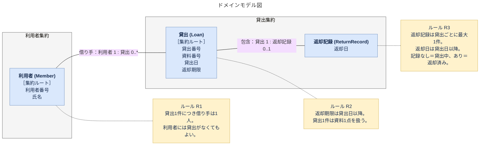
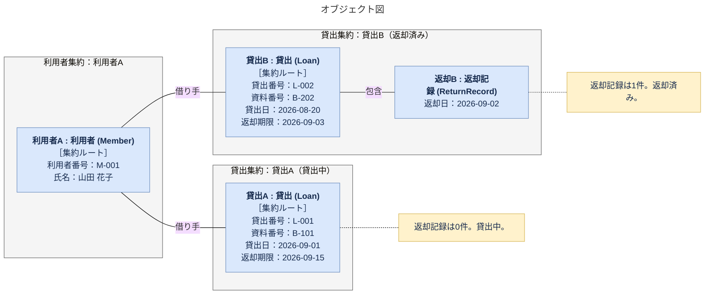

# 図書貸出モデル

貸出の登録と返却の記録を扱う架空の業務。資料は番号で識別します。

## ドメインモデル図

```mermaid
---
title: ドメインモデル図
config:
  theme: base
  markdownAutoWrap: false
---
flowchart LR
    subgraph MemberAggregate["利用者集約"]
        Member["`**利用者 (Member)**
［集約ルート］
利用者番号
氏名`"]
    end
    subgraph LoanAggregate["貸出集約"]
        Loan["`**貸出 (Loan)**
［集約ルート］
貸出番号
資料番号
貸出日
返却期限`"]
        ReturnRecord["`**返却記録 (ReturnRecord)**
返却日`"]
        Loan ---|"包含：貸出 1 : 返却記録 0..1"| ReturnRecord
    end
    Member ---|"借り手：利用者 1 : 貸出 0..*"| Loan
    R1["`ルール R1
貸出1件につき借り手は1人。
利用者には貸出がなくてもよい。`"]
    R2["`ルール R2
返却期限は貸出日以降。
貸出1件は資料1点を扱う。`"]
    R3["`ルール R3
返却記録は貸出ごとに最大1件。
返却日は貸出日以降。
記録なし＝貸出中、あり＝返却済み。`"]
    Member -.- R1
    Loan -.- R2
    ReturnRecord -.- R3
    classDef model fill:#dae8fc,stroke:#6c8ebf,color:#172B4D,text-align:center
    classDef note fill:#fff2cc,stroke:#d6b656,color:#172B4D
    class Member,Loan,ReturnRecord model
    class R1,R2,R3 note
    style MemberAggregate fill:#f5f5f5,stroke:#666666
    style LoanAggregate fill:#f5f5f5,stroke:#666666
```

## オブジェクト図

2026年9月6日時点。名前・番号・日付はすべて架空です。

```mermaid
---
title: オブジェクト図
config:
  theme: base
  markdownAutoWrap: false
---
flowchart LR
    subgraph MemberAGroup["利用者集約：利用者A"]
        MemberA["`**利用者A : 利用者 (Member)**
［集約ルート］
利用者番号：M-001
氏名：山田 花子`"]
    end
    subgraph LoanAGroup["貸出集約：貸出A（貸出中）"]
        LoanA["`**貸出A : 貸出 (Loan)**
［集約ルート］
貸出番号：L-001
資料番号：B-101
貸出日：2026-09-01
返却期限：2026-09-15`"]
    end
    subgraph LoanBGroup["貸出集約：貸出B（返却済み）"]
        LoanB["`**貸出B : 貸出 (Loan)**
［集約ルート］
貸出番号：L-002
資料番号：B-202
貸出日：2026-08-20
返却期限：2026-09-03`"]
        ReturnB["`**返却B : 返却記録 (ReturnRecord)**
返却日：2026-09-02`"]
        LoanB ---|"包含"| ReturnB
    end
    MemberA ---|"借り手"| LoanA
    MemberA ---|"借り手"| LoanB
    NoteA["返却記録は0件。貸出中。"]
    NoteB["返却記録は1件。返却済み。"]
    LoanA -.- NoteA
    ReturnB -.- NoteB
    classDef model fill:#dae8fc,stroke:#6c8ebf,color:#172B4D,text-align:center
    classDef note fill:#fff2cc,stroke:#d6b656,color:#172B4D
    class MemberA,LoanA,LoanB,ReturnB model
    class NoteA,NoteB note
    style MemberAGroup fill:#f5f5f5,stroke:#666666
    style LoanAGroup fill:#f5f5f5,stroke:#666666
    style LoanBGroup fill:#f5f5f5,stroke:#666666
```
